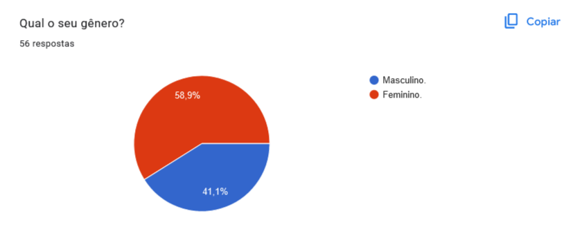
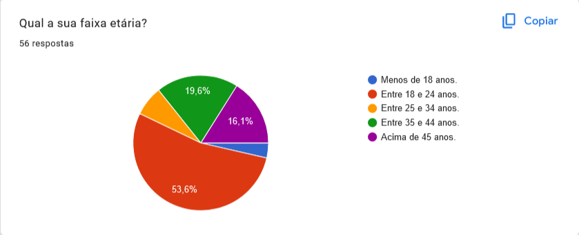
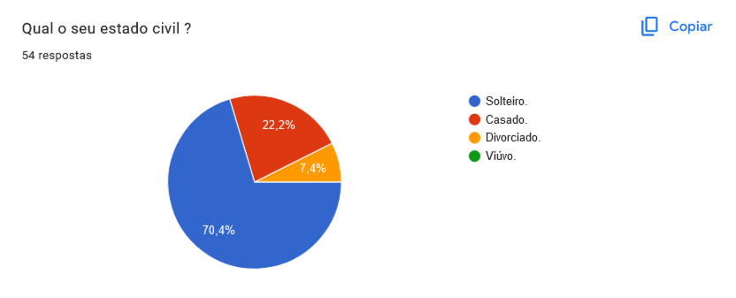
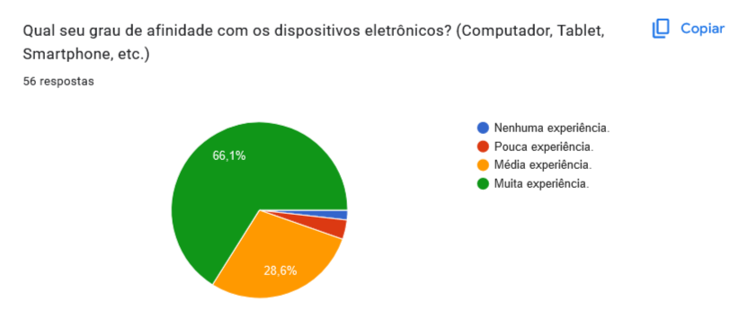
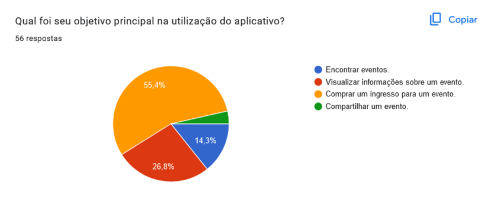
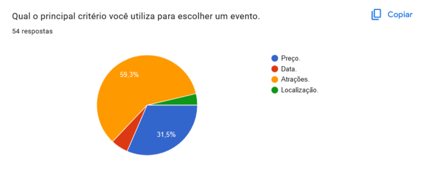

# Perfil de Usuário

## Introdução

&emsp;No intuito de se conhecer melhor os usuários do aplicativo é necessário elaborar um perfil genérico chamado de perfil de usuário. Segundo Barbosa e Silva (2011, p.174) <q>perfil de usuário é uma descrição detalhada das características dos usuários cujos objetivos devem ser apoiados pelo sistema sendo projetado</q>.

## Metodologia

&emsp;A principal técnica usada para a aquisição de dados foi o questionário. Além dele, foi utilizado uma ferramenta de tráfico de rede que permitiu realizar a validação dos dados obtidos.

&emsp;O questionário possuía 8 questões sobre aspectos gerais do usuário do aplicativo e foi divulgado em grupos da comunidade atráves do aplicativo whatsapp e telegram entre o período de 21 a 27 de abril de 2023.

## Resultado do Questionário

&emsp;O resultado no questionário teve o total de 56 respostas e o resumo das respostas são apresentados nas figuras de 1 a 8.

&emsp;De acordo com a figura 1, o gênero dos participantes em sua maioria é feminino represetando 59% das respostas sendo que o gênero masculino representa os outros 41%.

<figure markdown>

**Figura 1** - Questão 1.

Fonte: [Matheus Henrique](https://github.com/mathonaut) e [Rafael Ferreira](https://github.com/RafaelCLG0).

</figure>

&emsp;De acordo com o gráfico apresentado na figura 2 em relação a faixa etária dos participantes.

<figure markdown>

**Figura 2** - Questão 2.

Fonte: [Matheus Henrique](https://github.com/mathonaut) e [Rafael Ferreira](https://github.com/RafaelCLG0).

</figure>

&emsp;De acordo com o gráfico apresentado na figura 3 ...

<figure markdown>

**Figura 3** - Questão 3.

Fonte: [Matheus Henrique](https://github.com/mathonaut) e [Rafael Ferreira](https://github.com/RafaelCLG0).

</figure>

&emsp;De acordo com o gráfico apresentado na figura 4 ...

<figure markdown>

**Figura 4** - Questão 4.

Fonte: [Matheus Henrique](https://github.com/mathonaut) e [Rafael Ferreira](https://github.com/RafaelCLG0).

</figure>

&emsp;De acordo com o gráfico apresentado na figura 5 ...

<figure markdown>

**Figura 5** - Questão 5.

Fonte: [Matheus Henrique](https://github.com/mathonaut) e [Rafael Ferreira](https://github.com/RafaelCLG0).

</figure>

&emsp;De acordo com o gráfico apresentado na figura 6 ...

<figure markdown>

**Figura 6** - Questão 6.

Fonte: [Matheus Henrique](https://github.com/mathonaut) e [Rafael Ferreira](https://github.com/RafaelCLG0).

</figure>

&emsp;De acordo com o gráfico apresentado na figura 7 ...

<figure markdown>

**Figura 7** - Questão 7.

Fonte: [Matheus Henrique](https://github.com/mathonaut) e [Rafael Ferreira](https://github.com/RafaelCLG0).

</figure>

&emsp;De acordo com o gráfico apresentado na figura 8 ...

<figure markdown>

**Figura 8** - Questão 8.

Fonte: [Matheus Henrique](https://github.com/mathonaut) e [Rafael Ferreira](https://github.com/RafaelCLG0).

</figure>

## Definição do Perfil

&emsp;Após uma análise das respostas, foi traçado um Perfil de Usuário para o aplicativo com as seguintes descrições:

- **Gênero:** Em sua maioria feminino.
- **Idade:** Entre 18 e 24 anos.
- **Experiência:** Experiente.
- **Atitudes:** Tecnófilos.
- **Tarefas primárias:** Compra e consulta.

## Referências

> BARBOSA, S. D. J.; SILVA, B. S. Interação Humano-Computador. Rio de Janeiro: Elsevier, 2011.

## Bibliografia

> BARROS, Philipe de Sousa. Perfil do Usuário. Repositório da disciplina de Requisitos de Software da Universidade de Brasília, 2022. Disponível em: [https://requisitos-de-software.github.io/2022.2-Grasshopper/elicitacao/perfil-do-usuario/](https://requisitos-de-software.github.io/2022.2-Grasshopper/elicitacao/perfil-do-usuario/). Acesso em: 25 abr. 2023.

> FERREIRA, A. L. H. et al. Perfil do Usuário. Repositório da disciplina de Requisitos de Software da Universidade de Brasília, 2022. Disponível em: [https://requisitos-de-software.github.io/2022.2-MEI/Elicitacao/perfil/](https://requisitos-de-software.github.io/2022.2-MEI/Elicitacao/perfil/). Acesso em: 25 abr. 2023.

> MACHADO, M. et al. Personas. Repositório da disciplina de Requisitos de Software da Universidade de Brasília, 2022. Disponível em: [https://requisitos-de-software.github.io/2022.2-Lichess/elicitacao/personas/](https://requisitos-de-software.github.io/2022.2-Lichess/elicitacao/personas/). Acesso em: 25 abr. 2023.

## Histórico de Versões

| Versão | Data       | Descrição                           | Autor(es)                                                                                           | Revisor(es)                                    |
| ------ | ---------- | ----------------------------------- | --------------------------------------------------------------------------------------------------- | ---------------------------------------------- |
| `1.0`  | 27/04/2023 | Criação da página.                  | [Matheus Henrique](https://github.com/mathonaut) e [Rafael Ferreira](https://github.com/RafaelCLG0) | [Geovanna Maciel](https://github.com/manuziny) |
| `1.1`  | 27/04/2023 | Adição da introdução e metodologia. | [Matheus Henrique](https://github.com/mathonaut) e [Rafael Ferreira](https://github.com/RafaelCLG0) | [Geovanna Maciel](https://github.com/manuziny) |
| `1.2`  | 27/04/2023 | Adição das questões.                | [Matheus Henrique](https://github.com/mathonaut) e [Rafael Ferreira](https://github.com/RafaelCLG0) | [Geovanna Maciel](https://github.com/manuziny) |
