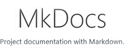
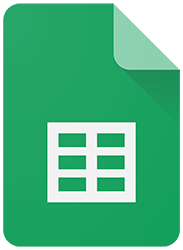

# Ferramentas

## Introdução

A fim de facilitar o gerenciamento e a execução do projeto, foram utilizadas certas ferramentas para o aumento da produtividade. As ferramentas selecionadas são apresentadas na tabela 1.

<b>Tabela 1</b> - Ferramentas Utilizadas no Projeto

|                                                              |     Ferramenta     |                               Finalidade                               |
| :----------------------------------------------------------: | :----------------: | :--------------------------------------------------------------------: |
|              |       GitHub       | Organizar, versionar e documentar artefatos produzidos para o projeto. |
|      |       Teams        |         Realizações de reuniões e gravações de apresentações.          |
|                |       Figma        |                    Produção de artefatos gráficos.                     |
|              |       MkDocs       |                  Criação das páginas de docuentação.                   |
|  | Visual Studio Code |                  Edição dos arquivos de documentação.                  |
|          |      WhatsApp      |             Utilizado como principal canal de comunicação.             |
|            |      YouTube       |                    Hospedagem de vídeos produzidos.                    |
|   |  Google Planilhas  |      Criação de planilhas relacionadas ao cronograma e horários.       |

Fonte: Autores.

## Histórico de Versão

| Versão |    Data    |             Descrição             |                                                        Autor(es)                                                        |                        Revisor(es)                        |
| :----: | :--------: | :-------------------------------: | :---------------------------------------------------------------------------------------------------------------------: | :-------------------------------------------------------: |
| `1.0`  | 15/04/2023 | Criação da página de ferramentas. | <a href="https://github.com/mathonaut">Matheus Henrique</a> e <a href="https://github.com/arthurmlv">Arthur de Melo</a> | <a href="https://github.com/manuziny">Geovanna Maciel</a> |
