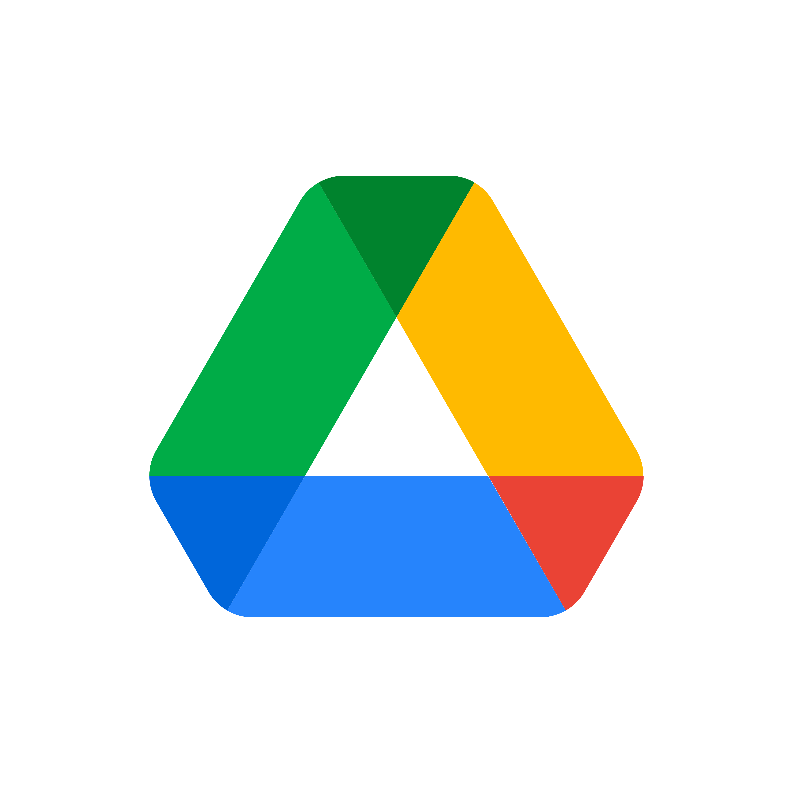

# Ferramentas

## Introdução

A fim de facilitar o gerenciamento e a execução do projeto, foram utilizadas certas ferramentas com o intuito de facilitar certas atividades e produção de artefatos. As ferramentas selecionadas para a realização do projeto estão apresentadas na Tabela 1.

## Ferramentas Utilizadas

<b>Tabela 1</b> - Ferramentas Utilizadas no Projeto

|                                                                                                |     Ferramenta      |                               Finalidade                               |
| :----------------------------------------------------------------------------------------------: | ------------------- | ---------------------------------------------------------------------- |
|       {: style="height:100px;width:100px"}     |    GitHub           | Organizar, versionar e documentar artefatos produzidos para o projeto. |
|   {: style="height:87px;width:100px"}  |    Teams            |         Realizações de reuniões e gravações de apresentações.          |
|        {: style="height:94px;width:63px"}        |    Figma            |                    Produção de artefatos gráficos.                     |
|                                                |    MkDocs           |                 Criação das páginas de documentação.                   |
| {: style="height:85px;width:85px"} |    Visual Studio Code|                  Edição dos arquivos de documentação.                  |
|     {: style="height:85px;width:85px"}     |    WhatsApp         |             Utilizado como principal canal de comunicação.             |
|      {: style="height:56px;width:250px"}     |    YouTube          |                    Hospedagem de vídeos produzidos.                    |
| {: style="height:94px;width:72px"}  |    Google Planilhas |      Criação de planilhas relacionadas ao cronograma e horários.       |
| {: style="height:96px;width:96px"}         |    Google Docs      |      Criação e edição de tabelas e arquivos.                           |
| {: style="height:128px;width:128px"}     |    Google Drive     |      Compartilhamento de arquivos.                                     |
| {: style="height:100px;width:100px"}          |    Draw.io          |      Produção da primeira versão do Rich Picture.                      |

Fonte: Autores.

## Histórico de Versões

| Versão |    Data    |             Descrição             |                                                        Autor(es)                                                        |                        Revisor(es)                        |
| ---- | -------- | ------------------------------- | --------------------------------------------------------------------------------------------------------------------- | ------------------------------------------------------- |
| `1.0`  | 15/04/2023 | Criação da página de ferramentas. | <a href="https://github.com/mathonaut">Matheus Henrique</a> e <a href="https://github.com/arthurmlv">Arthur de Melo</a> | <a href="https://github.com/manuziny">Geovanna Maciel</a> |
| `1.1`  | 15/04/2023 | Adição de novas ferramentas e reajuste da Tabela 1. | <a href="https://github.com/mathonaut">Matheus Henrique</a> e <a href="https://github.com/arthurmlv">Arthur de Melo</a> | <a href="https://github.com/manuziny">Geovanna Maciel</a> |
| `1.1.1`  | 15/04/2023 | Pequenos ajustes nos textos e adição de uma ferramenta. | <a href="https://github.com/mathonaut">Matheus Henrique</a> e <a href="https://github.com/arthurmlv">Arthur de Melo</a> | <a href="https://github.com/manuziny">Geovanna Maciel</a> |
