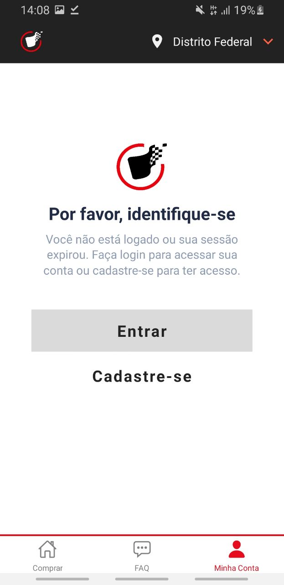
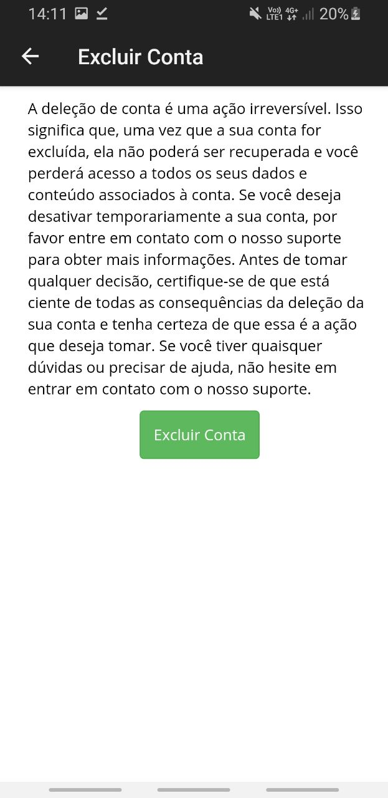
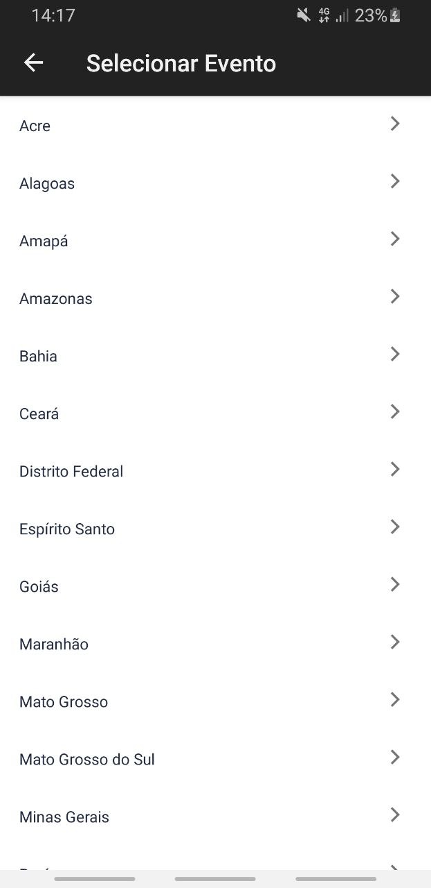
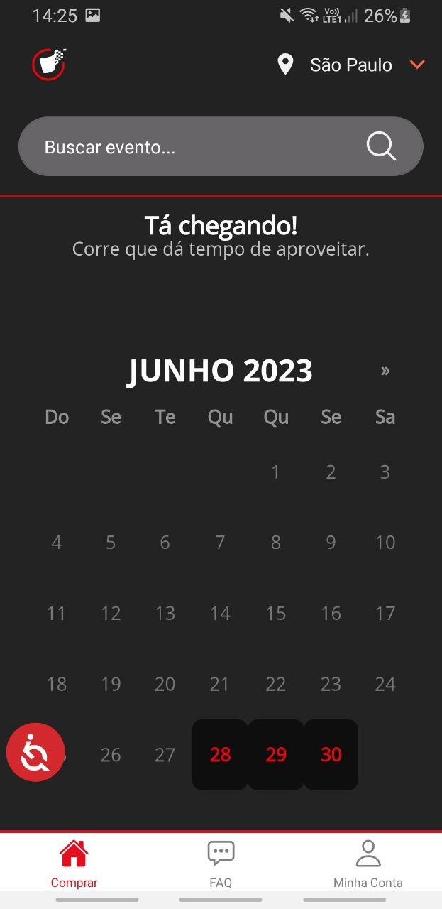
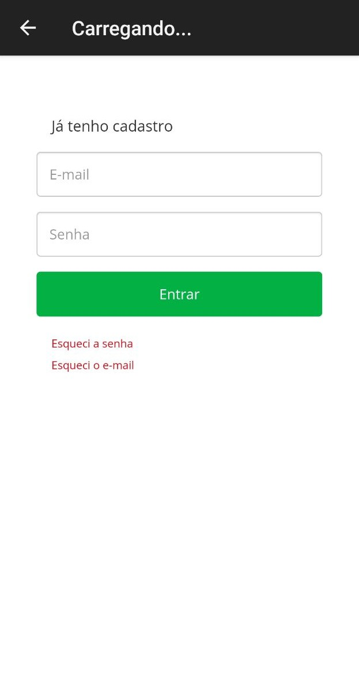

# Pós-Rastreabilidade

## Introdução

Este artefato objetiva realizar a conexão entre requisitos, arquitetura e implementação. Portanto, explicitar-se-á a relação de dependência entre requisitos e seus artefatos relacionados: de requisitos, de arquitetura e de implementação. A rastreabilidade é composta por ligações ou elos dadas pela interrelação dos artefatos especificados<a id="REF1" href="#anchor_1">^1^</a>.

## Metodologia

O meta-modelo utilizado como base para a realização da rastreabilidade foi proposto por Toranzo. Nesse modelo, todas as informações rastreadas podem ser classificadas em quatro categorias<a id="REF2" href="#anchor_2">^2^</a>:

- Ambiental: lei, objetivos, estratégias e padrão.
- Organizacional: objetivos, regras e processo.
- Gerencial: objetivos, tarefas e restrições.
- Desenvolvimento: requisitos, diagramas e programa.

Contudo, no escopo do projeto todas as informações rastreadas se encontram na categoria de desenvolvimento. Além disso, fez-se uma adaptação do meta-modelo de Toranzo para a realização da pós-rastreabilidade, a qual explicita a conexão entre artefatos de desenho e de implementação aos requisitos elicitados e vice-versa. Nesse modelo, os elos são definidos por: satisfação, recurso, responsabilidade, representação, alocado e agregação<a id="REF2" href="#anchor_2">^2^</a>. No entanto, o elo de resposabilidade não será abordado neste artefato, dado que as informações presentes nos artefatos impede a realização de tal rastreabilidade.

A rastreabilidade foi feita somente nos requisitos não implementados pela Bilheteria Digital, sendo alguns implementados no protótipo de alta fidelidade feito para a [Validação](https://requisitos-de-software.github.io/2023.1-BilheteriaDigital/validacao/prototipo/). A tabela 1 mostra o template utilizado para a pós-rastreabilidade dos requisitos.

Tabela 1 - Template Pós-Rastreabilidade

| Artefato Analisado     | Classificação do Artefato Analisado |
| :----------------------: | :--------------------: |
| Tipos de Elo | Artefatos Relacionados |
| Satisfação | - |
| Recurso | - |
| Representação | - |
| Alocado | - |
| Agregação | - |

Fonte: Meta-modelo de Toranzo (TORANZO, 2002)<a id="REF2" href="#anchor_2">^2^</a>.

## Rastreabilidade

Neste tópico, serão apresentadas as tabelas referentes aos elos dos artefatos analisados, que se referem aos requisitos implementados e não implementados pela Bilheteria Digital. Sendo assim, as Tabelas de 2 a 48 apresentam a rastreabilidade dos requisitos funcionais e não funcionais.

### RF01

O aplicativo filtra os eventos por Estado e por Município.

Tabela 2 - RF01

| [RF01](https://requisitos-de-software.github.io/2023.1-BilheteriaDigital/elicitacao/requisitos_elicitados/#requisitos-funcionais)     | Desenvolvimento |
| :----------------------: | -------------------- |
| Tipos de Elo | Artefatos Relacionados |
| Satisfação | [Especificação Suplementar USA03](https://requisitos-de-software.github.io/2023.1-BilheteriaDigital/modelagem/especificacao-suplementar/#usabilidade)   [NFR Eficiência](https://requisitos-de-software.github.io/2023.1-BilheteriaDigital/modelagem/agil/nfrframework/#nfr-02-eficiencia) |
| Recurso | [Cenário 04](https://requisitos-de-software.github.io/2023.1-BilheteriaDigital/modelagem/cenarios/#cenario-4)   [Requisitos NFR02 e NFR03](https://requisitos-de-software.github.io/2023.1-BilheteriaDigital/modelagem/agil/nfrframework/#requisitos-nao-funcionais)   [Especificação Suplementar CON01 e CON02](https://requisitos-de-software.github.io/2023.1-BilheteriaDigital/modelagem/especificacao-suplementar/#confiabilidade) |
| Representação | [Protótipo de Alta Fidelidade](https://www.figma.com/proto/CSsRpoXBR0BWWojN1ZrDn0/Protótipo-de-Alta-FIdelidade?page-id=0%3A1&type=design&node-id=107-1118&viewport=29390%2C34193%2C3.02&scaling=min-zoom&starting-point-node-id=107%3A1118&show-proto-sidebar=1) |
| Alocado | [Léxico 01](https://requisitos-de-software.github.io/2023.1-BilheteriaDigital/modelagem/lexicos/#l01-filtrar-eventos)   [Épico 1 - Feature 1](https://requisitos-de-software.github.io/2023.1-BilheteriaDigital/modelagem/agil/backlog/#metodologia)   [NFR Usabilidade](https://requisitos-de-software.github.io/2023.1-BilheteriaDigital/modelagem/agil/nfrframework/#nfr-01-usabilidade)   [Casos de Uso UC01](https://requisitos-de-software.github.io/2023.1-BilheteriaDigital/modelagem/useCase/#especializacao-dos-casos-de-uso) |
| Agregação | [Cenário 04](https://requisitos-de-software.github.io/2023.1-BilheteriaDigital/modelagem/cenarios/#cenario-4)   [História de Usuário US01](https://requisitos-de-software.github.io/2023.1-BilheteriaDigital/modelagem/agil/historia-de-usuario/#us01)   Requisitos: <a href="../../elicitacao/tecnicas/introspeccao/#anchor_IS">IS01</a>, <a href="../../elicitacao/elicitacao/tecnicas/brainstorming/#anchor_BS">BS08</a> e <a href="../../elicitacao/tecnicas/observacao/#anchor_OBS">OBS01</a> |

Fonte: [Arthur de Melo](https://github.com/arthurmlv) e [Rafael Ferreira](https://github.com/RafaelCLG0).

### RF02

O aplicativo filtra os eventos por data e por horário.

Tabela 3 - RF02

| [RF02](https://requisitos-de-software.github.io/2023.1-BilheteriaDigital/elicitacao/requisitos_elicitados/#requisitos-funcionais)     | Desenvolvimento |
| :----------------------: | -------------------- |
| Tipos de Elo | Artefatos Relacionados |
| Satisfação | [Especificação Suplementar USA04](https://requisitos-de-software.github.io/2023.1-BilheteriaDigital/modelagem/especificacao-suplementar/#usabilidade)   [NFR Eficiência](https://requisitos-de-software.github.io/2023.1-BilheteriaDigital/modelagem/agil/nfrframework/#nfr-02-eficiencia) |
| Recurso | [Cenário 02](https://requisitos-de-software.github.io/2023.1-BilheteriaDigital/modelagem/cenarios/#cenario-2)   [Requisitos NFR02 e NFR03](https://requisitos-de-software.github.io/2023.1-BilheteriaDigital/modelagem/agil/nfrframework/#requisitos-nao-funcionais)   [Especificação Suplementar CON01 e CON02](https://requisitos-de-software.github.io/2023.1-BilheteriaDigital/modelagem/especificacao-suplementar/#confiabilidade) |
| Representação | [Protótipo de Alta Fidelidade](https://www.figma.com/proto/CSsRpoXBR0BWWojN1ZrDn0/Protótipo-de-Alta-FIdelidade?page-id=0%3A1&type=design&node-id=107-1118&viewport=29390%2C34193%2C3.02&scaling=min-zoom&starting-point-node-id=107%3A1118&show-proto-sidebar=1)   [Casos de Uso](https://requisitos-de-software.github.io/2023.1-BilheteriaDigital/modelagem/useCase/#diagrama-de-casos-de-uso) |
| Alocado | [Léxico 01](https://requisitos-de-software.github.io/2023.1-BilheteriaDigital/modelagem/lexicos/#l01-filtrar-eventos)   [Épico 1 - Feature 1](https://requisitos-de-software.github.io/2023.1-BilheteriaDigital/modelagem/agil/backlog/#metodologia)   [NFR Usabilidade](https://requisitos-de-software.github.io/2023.1-BilheteriaDigital/modelagem/agil/nfrframework/#nfr-01-usabilidade)   [Casos de Uso UC01](https://requisitos-de-software.github.io/2023.1-BilheteriaDigital/modelagem/useCase/#especializacao-dos-casos-de-uso) |
| Agregação | [História de Usuário US04](https://requisitos-de-software.github.io/2023.1-BilheteriaDigital/modelagem/agil/historia-de-usuario/#us04)   Requisitos: <a href="../../elicitacao/tecnicas/introspeccao/#anchor_IS">IS02</a> e <a href="../../elicitacao/tecnicas/questionario/#anchor_Q">Q03</a> |

Fonte: [Arthur de Melo](https://github.com/arthurmlv) e [Rafael Ferreira](https://github.com/RafaelCLG0).

### RF03

O aplicativo filtra os eventos por idade mínima de entrada.

Tabela 4 - RF03

| [RF03](https://requisitos-de-software.github.io/2023.1-BilheteriaDigital/elicitacao/requisitos_elicitados/#requisitos-funcionais)     | Desenvolvimento |
| :----------------------: | -------------------- |
| Tipos de Elo | Artefatos Relacionados |
| Satisfação | [Especificação Suplementar USA04](https://requisitos-de-software.github.io/2023.1-BilheteriaDigital/modelagem/especificacao-suplementar/#usabilidade)   [NFR Eficiência](https://requisitos-de-software.github.io/2023.1-BilheteriaDigital/modelagem/agil/nfrframework/#nfr-02-eficiencia) |
| Recurso | [Cenário 03](https://requisitos-de-software.github.io/2023.1-BilheteriaDigital/modelagem/cenarios/#cenario-3)   [Requisitos NFR02 e NFR03](https://requisitos-de-software.github.io/2023.1-BilheteriaDigital/modelagem/agil/nfrframework/#requisitos-nao-funcionais)   [Especificação Suplementar CON01 e CON02](https://requisitos-de-software.github.io/2023.1-BilheteriaDigital/modelagem/especificacao-suplementar/#confiabilidade) |
| Representação | [Protótipo de Alta Fidelidade](https://www.figma.com/proto/CSsRpoXBR0BWWojN1ZrDn0/Protótipo-de-Alta-FIdelidade?page-id=0%3A1&type=design&node-id=107-1118&viewport=29390%2C34193%2C3.02&scaling=min-zoom&starting-point-node-id=107%3A1118&show-proto-sidebar=1)   [Casos de Uso](https://requisitos-de-software.github.io/2023.1-BilheteriaDigital/modelagem/useCase/#diagrama-de-casos-de-uso) |
| Alocado | [Léxico 01](https://requisitos-de-software.github.io/2023.1-BilheteriaDigital/modelagem/lexicos/#l01-filtrar-eventos)   [Épico 1 - Feature 2](https://requisitos-de-software.github.io/2023.1-BilheteriaDigital/modelagem/agil/backlog/#metodologia)    [NFR Usabilidade](https://requisitos-de-software.github.io/2023.1-BilheteriaDigital/modelagem/agil/nfrframework/#nfr-01-usabilidade)   [Casos de Uso UC01](https://requisitos-de-software.github.io/2023.1-BilheteriaDigital/modelagem/useCase/#especializacao-dos-casos-de-uso)  |
| Agregação | Requisitos: <a href="../../elicitacao/tecnicas/introspeccao/#anchor_IS">IS03</a> e <a href="../../elicitacao/tecnicas/questionario/#anchor_Q">Q02</a> |

Fonte: [Arthur de Melo](https://github.com/arthurmlv) e [Rafael Ferreira](https://github.com/RafaelCLG0).

### RF04

O aplicativo permite realizar a compra do ingresso.

Tabela 5 - RF04

| [RF04](https://requisitos-de-software.github.io/2023.1-BilheteriaDigital/elicitacao/requisitos_elicitados/#requisitos-funcionais)     | Desenvolvimento |
| :----------------------: | -------------------- |
| Tipos de Elo | Artefatos Relacionados |
| Satisfação | [Especificação Suplementar USA04](https://requisitos-de-software.github.io/2023.1-BilheteriaDigital/modelagem/especificacao-suplementar/#usabilidade)   [Cartão de Especificação 3](https://requisitos-de-software.github.io/2023.1-BilheteriaDigital/modelagem/agil/nfrframework/#cartoes-de-especificacao) |
| Recurso | [Especificação Suplementar USA05](https://requisitos-de-software.github.io/2023.1-BilheteriaDigital/modelagem/especificacao-suplementar/#usabilidade) |
| Representação | <figure markdown>{: style="height:500px;width:250px"} | 
| Alocado | - |
| Agregação |  [Cenário 05](https://requisitos-de-software.github.io/2023.1-BilheteriaDigital/modelagem/cenarios/#cenario-5)   [História de Usuário US07](https://requisitos-de-software.github.io/2023.1-BilheteriaDigital/modelagem/agil/historia-de-usuario/#us07)   Requisitos: <a href="../../elicitacao/tecnicas/introspeccao/#anchor_IS">IS04</a>, <a href="../../elicitacao/tecnicas/brainstorming/#anchor_BS">BS03</a>, <a href="../../elicitacao/tecnicas/observacao/#anchor_OBS">OBS10</a> |

Fonte: [Arthur de Melo](https://github.com/arthurmlv) e [Rafael Ferreira](https://github.com/RafaelCLG0).

### RF05

O aplicativo permite o cadastro e o login do usuário.

Tabela 6 - RF05

| [RF05](https://requisitos-de-software.github.io/2023.1-BilheteriaDigital/elicitacao/requisitos_elicitados/#requisitos-funcionais)     | Desenvolvimento |
| :----------------------: | -------------------- |
| Tipos de Elo | Artefatos Relacionados |
| Satisfação | [História de Usuário US09](https://requisitos-de-software.github.io/2023.1-BilheteriaDigital/modelagem/agil/historia-de-usuario/#us09)   [História de Usuário US25](https://requisitos-de-software.github.io/2023.1-BilheteriaDigital/modelagem/agil/historia-de-usuario/#us25)   [História de Usuário US28](https://requisitos-de-software.github.io/2023.1-BilheteriaDigital/modelagem/agil/historia-de-usuario/#us28) |
| Recurso | [História de Usuário US27](https://requisitos-de-software.github.io/2023.1-BilheteriaDigital/modelagem/agil/historia-de-usuario/#us27)   [Épico 3 - Feature 6](https://requisitos-de-software.github.io/2023.1-BilheteriaDigital/modelagem/agil/backlog/#metodologia) |
| Representação | <figure markdown>{: style="height:500px;width:250px"} |
| Alocado | - |
| Agregação | Requisitos: <a href="../../elicitacao/tecnicas/introspeccao/#anchor_IS">IS05</a>, <a href="../../elicitacao/tecnicas/brainstorming/#anchor_BS">BS01, <a href="../../elicitacao/tecnicas/brainstorming/#anchor_BS">BS02</a> |

Fonte: [Arthur de Melo](https://github.com/arthurmlv) e [Rafael Ferreira](https://github.com/RafaelCLG0).

### RF06

O aplicativo permite excluir cadastro.

Tabela 7 - RF06

| [RF06](https://requisitos-de-software.github.io/2023.1-BilheteriaDigital/elicitacao/requisitos_elicitados/#requisitos-funcionais)     | Desenvolvimento |
| :----------------------: | -------------------- |
| Tipos de Elo | Artefatos Relacionados |
| Satisfação | - |
| Recurso | - |
| Representação | <figure markdown>{: style="height:500px;width:250px"} |
| Alocado | - |
| Agregação | Requisito:  <a href="../../elicitacao/tecnicas/introspeccao/#anchor_IS">IS06</a> |

Fonte: [Arthur de Melo](https://github.com/arthurmlv) e [Rafael Ferreira](https://github.com/RafaelCLG0).

### RF07

O aplicativo permite cadastrar métodos de pagamento.

Tabela 8 - RF07

| [RF07](https://requisitos-de-software.github.io/2023.1-BilheteriaDigital/elicitacao/requisitos_elicitados/#requisitos-funcionais)     | Desenvolvimento |
| :----------------------: | -------------------- |
| Tipos de Elo | Artefatos Relacionados |
| Satisfação | [Especificação Suplementar USA05](https://requisitos-de-software.github.io/2023.1-BilheteriaDigital/modelagem/especificacao-suplementar/#usabilidade)   [Especificação Suplementar CON03](https://requisitos-de-software.github.io/2023.1-BilheteriaDigital/modelagem/especificacao-suplementar/#confiabilidade) |
| Recurso | [Casos de Uso UC03](https://requisitos-de-software.github.io/2023.1-BilheteriaDigital/modelagem/useCase/#especializacao-dos-casos-de-uso)  |
| Representação | [Cenário 05](https://requisitos-de-software.github.io/2023.1-BilheteriaDigital/modelagem/cenarios/#cenario-5)   [Épico 2 - Feature 4](https://requisitos-de-software.github.io/2023.1-BilheteriaDigital/modelagem/agil/backlog/#metodologia)   <figure markdown>{: style="height:500px;width:250px"} |
| Alocado | - |
| Agregação | Requisitos: <a href="../../elicitacao/tecnicas/introspeccao/#anchor_IS">IS07</a>, <a href="../../elicitacao/tecnicas/questionario/#anchor_Q">Q08, <a href="../../elicitacao/tecnicas/brainstorming/#anchor_BS">BS15</a> |

Fonte: [Arthur de Melo](https://github.com/arthurmlv) e [Rafael Ferreira](https://github.com/RafaelCLG0).

### RF08

O aplicativo permite cancelar compras.

Tabela 9 - RF08

| [RF08](https://requisitos-de-software.github.io/2023.1-BilheteriaDigital/elicitacao/requisitos_elicitados/#requisitos-funcionais)     | Desenvolvimento |
| :----------------------: | -------------------- |
| Tipos de Elo | Artefatos Relacionados |
| Satisfação | - |
| Recurso | - |
| Representação | [História de Usuário US20](https://requisitos-de-software.github.io/2023.1-BilheteriaDigital/modelagem/agil/historia-de-usuario/#us27)   [Épico 5 - Feature 11](https://requisitos-de-software.github.io/2023.1-BilheteriaDigital/modelagem/agil/backlog/#metodologia) |
| Alocado | - |
| Agregação | Requisitos: <a href="../../elicitacao/tecnicas/introspeccao/#anchor_IS">IS08</a>, <a href="../../elicitacao/tecnicas/questionario/#anchor_Q">Q09</a>, <a href="../../elicitacao/tecnicas/observacao/#anchor_IS">OBS12</a> |

Fonte: [Arthur de Melo](https://github.com/arthurmlv) e [Rafael Ferreira](https://github.com/RafaelCLG0).

### RF09

O aplicativo possui um mecanismo de busca.

Tabela 10 - RF09

| [RF09](https://requisitos-de-software.github.io/2023.1-BilheteriaDigital/elicitacao/requisitos_elicitados/#requisitos-funcionais)     | Desenvolvimento |
| :----------------------: | -------------------- |
| Tipos de Elo | Artefatos Relacionados |
| Satisfação | [Especificação Suplementar USA04](https://requisitos-de-software.github.io/2023.1-BilheteriaDigital/modelagem/especificacao-suplementar/#usabilidade) |
| Recurso | [Léxico 01](https://requisitos-de-software.github.io/2023.1-BilheteriaDigital/modelagem/lexicos/#l01-filtrar-eventos)   [Léxico 02](https://requisitos-de-software.github.io/2023.1-BilheteriaDigital/modelagem/lexicos/#l03-evento-com-tags)   [Cenário 01](https://requisitos-de-software.github.io/2023.1-BilheteriaDigital/modelagem/cenarios/#cenario-1)   [Cenário 02](https://requisitos-de-software.github.io/2023.2-BilheteriaDigital/modelagem/cenarios/#cenario-2)   [Cenário 03](https://requisitos-de-software.github.io/2023.1-BilheteriaDigital/modelagem/cenarios/#cenario-3)   [Cenário 04](https://requisitos-de-software.github.io/2023.1-BilheteriaDigital/modelagem/cenarios/#cenario-4) |
| Representação | [Casos de Uso UC01](https://requisitos-de-software.github.io/2023.1-BilheteriaDigital/modelagem/useCase/#especializacao-dos-casos-de-uso)   <figure markdown>{: style="height:500px;width:250px"} |
| Alocado | - |
| Agregação | Requisitos: <a href="../../elicitacao/tecnicas/introspeccao/#anchor_IS">IS09</a>, <a href="../../elicitacao/tecnicas/questionario/#anchor_Q">Q01</a>, <a href="../../elicitacao/tecnicas/brainstorm/#anchor_BS">BS04</a>, <a href="../../elicitacao/tecnicas/observacao/#anchor_OBS">OBS02</a> |

Fonte: [Arthur de Melo](https://github.com/arthurmlv) e [Rafael Ferreira](https://github.com/RafaelCLG0).

### RF10

O aplicativo filtra eventos por categorias.

Tabela 11 - RF10

| [RF10](https://requisitos-de-software.github.io/2023.1-BilheteriaDigital/elicitacao/requisitos_elicitados/#requisitos-funcionais)     | Desenvolvimento |
| :----------------------: | -------------------- |
| Tipos de Elo | Artefatos Relacionados |
| Satisfação | [Especificação Suplementar USA04](https://requisitos-de-software.github.io/2023.1-BilheteriaDigital/modelagem/especificacao-suplementar/#usabilidade)   [NFR Eficiência](https://requisitos-de-software.github.io/2023.1-BilheteriaDigital/modelagem/agil/nfrframework/#nfr-02-eficiencia) |
| Recurso | [Cenário 01](https://requisitos-de-software.github.io/2023.1-BilheteriaDigital/modelagem/cenarios/#cenario-1)   [Requisitos NFR02 e NFR03](https://requisitos-de-software.github.io/2023.1-BilheteriaDigital/modelagem/agil/nfrframework/#requisitos-nao-funcionais)   [Especificação Suplementar CON01 e CON02](https://requisitos-de-software.github.io/2023.1-BilheteriaDigital/modelagem/especificacao-suplementar/#confiabilidade) |
| Representação | [Protótipo de Alta Fidelidade](https://www.figma.com/proto/CSsRpoXBR0BWWojN1ZrDn0/Protótipo-de-Alta-FIdelidade?page-id=0%3A1&type=design&node-id=107-1118&viewport=29390%2C34193%2C3.02&scaling=min-zoom&starting-point-node-id=107%3A1118&show-proto-sidebar=1)   [Casos de Uso](https://requisitos-de-software.github.io/2023.1-BilheteriaDigital/modelagem/useCase/#diagrama-de-casos-de-uso)   [História de Usuário US02](https://requisitos-de-software.github.io/2023.1-BilheteriaDigital/modelagem/agil/historia-de-usuario/#us02) |
| Alocado | [Léxico 01](https://requisitos-de-software.github.io/2023.1-BilheteriaDigital/modelagem/lexicos/#l01-filtrar-eventos)   [Épico 1 - Feature 2](https://requisitos-de-software.github.io/2023.1-BilheteriaDigital/modelagem/agil/backlog/#metodologia)    [NFR Usabilidade](https://requisitos-de-software.github.io/2023.1-BilheteriaDigital/modelagem/agil/nfrframework/#nfr-01-usabilidade)   [Casos de Uso UC01](https://requisitos-de-software.github.io/2023.1-BilheteriaDigital/modelagem/useCase/#especializacao-dos-casos-de-uso) |
| Agregação | Requisito: <a href="../../elicitacao/tecnicas/questionario/#anchor_Q">Q04</a> |

Fonte: [Arthur de Melo](https://github.com/arthurmlv) e [Rafael Ferreira](https://github.com/RafaelCLG0).

### RF11

O aplicativo dá sugestões de eventos com base no histórico de buscas do usuário.

Tabela 12 - RF11

| [RF11](https://requisitos-de-software.github.io/2023.1-BilheteriaDigital/elicitacao/requisitos_elicitados/#requisitos-funcionais)     | Desenvolvimento |
| :----------------------: | -------------------- |
| Tipos de Elo | Artefatos Relacionados |
| Satisfação | [Especificação Suplementar USA06](https://requisitos-de-software.github.io/2023.1-BilheteriaDigital/modelagem/especificacao-suplementar/#usabilidade)   [NFR Eficiência](https://requisitos-de-software.github.io/2023.1-BilheteriaDigital/modelagem/agil/nfrframework/#nfr-02-eficiencia) |
| Recurso | [Requisitos NFR02 e NFR03](https://requisitos-de-software.github.io/2023.1-BilheteriaDigital/modelagem/agil/nfrframework/#requisitos-nao-funcionais)   [Especificação Suplementar CON01 e CON02](https://requisitos-de-software.github.io/2023.1-BilheteriaDigital/modelagem/especificacao-suplementar/#confiabilidade) |
| Representação | [Léxico 02](https://requisitos-de-software.github.io/2023.1-BilheteriaDigital/modelagem/lexicos/#l02-sugestoes-de-eventos)  |
| Alocado | [Léxico 01](https://requisitos-de-software.github.io/2023.1-BilheteriaDigital/modelagem/lexicos/#l01-filtrar-eventos)   [NFR Usabilidade](https://requisitos-de-software.github.io/2023.1-BilheteriaDigital/modelagem/agil/nfrframework/#nfr-01-usabilidade) |
| Agregação | [Casos de Uso UC02](https://requisitos-de-software.github.io/2023.1-BilheteriaDigital/modelagem/useCase/#especializacao-dos-casos-de-uso)   Requisitos: <a href="../../elicitacao/tecnicas/questionario/#anchor_Q">Q05</a> e <a href="../../elicitacao/tecnicas/brainstorming/#anchor_BS">BS11</a> |

Fonte: [Arthur de Melo](https://github.com/arthurmlv) e [Rafael Ferreira](https://github.com/RafaelCLG0).

### RF12

O aplicativo tem palavras-chave ou tags associadas a eventos para facilitar a busca.

Tabela 13 - RF12

| [RF12](https://requisitos-de-software.github.io/2023.1-BilheteriaDigital/elicitacao/requisitos_elicitados/#requisitos-funcionais)     | Desenvolvimento |
| :----------------------: | -------------------- |
| Tipos de Elo | Artefatos Relacionados |
| Satisfação | [Especificação Suplementar DES01](https://requisitos-de-software.github.io/2023.1-BilheteriaDigital/modelagem/especificacao-suplementar/#desempenho)   [NFR Eficiência](https://requisitos-de-software.github.io/2023.1-BilheteriaDigital/modelagem/agil/nfrframework/#nfr-02-eficiencia) |
| Recurso | [Requisitos NFR02 e NFR03](https://requisitos-de-software.github.io/2023.1-BilheteriaDigital/modelagem/agil/nfrframework/#requisitos-nao-funcionais)   [Especificação Suplementar CON01 e CON02](https://requisitos-de-software.github.io/2023.1-BilheteriaDigital/modelagem/especificacao-suplementar/#confiabilidade) |
| Representação | [Léxico 03](https://requisitos-de-software.github.io/2023.1-BilheteriaDigital/modelagem/lexicos/#l03-evento-com-tags) |
| Alocado | [NFR Usabilidade](https://requisitos-de-software.github.io/2023.1-BilheteriaDigital/modelagem/agil/nfrframework/#nfr-01-usabilidade)   [Casos de Uso UC02](https://requisitos-de-software.github.io/2023.1-BilheteriaDigital/modelagem/useCase/#especializacao-dos-casos-de-uso) |
| Agregação | Requisito: <a href="../../elicitacao/tecnicas/questionario/#anchor_Q">Q06</a> |

Fonte: [Arthur de Melo](https://github.com/arthurmlv) e [Rafael Ferreira](https://github.com/RafaelCLG0).

### RF13

O aplicativo notifica usuário sobre eventos, quando permitido.

Tabela 14 - RF13

| [RF13](https://requisitos-de-software.github.io/2023.1-BilheteriaDigital/elicitacao/requisitos_elicitados/#requisitos-funcionais)     | Desenvolvimento |
| :----------------------: | -------------------- |
| Tipos de Elo | Artefatos Relacionados |
| Satisfação | [Especificação Suplementar USA06](https://requisitos-de-software.github.io/2023.1-BilheteriaDigital/modelagem/especificacao-suplementar/#usabilidade)   [Especificação Suplementar DES01 e DES05](https://requisitos-de-software.github.io/2023.1-BilheteriaDigital/modelagem/especificacao-suplementar/#desempenho)   [NFR Eficiência](https://requisitos-de-software.github.io/2023.1-BilheteriaDigital/modelagem/agil/nfrframework/#nfr-02-eficiencia) |
| Recurso | [Casos de Uso UC02](https://requisitos-de-software.github.io/2023.1-BilheteriaDigital/modelagem/useCase/#especializacao-dos-casos-de-uso)   [Requisitos NFR02 e NFR03](https://requisitos-de-software.github.io/2023.1-BilheteriaDigital/modelagem/agil/nfrframework/#requisitos-nao-funcionais)   [Especificação Suplementar CON01 e CON02](https://requisitos-de-software.github.io/2023.1-BilheteriaDigital/modelagem/especificacao-suplementar/#confiabilidade) |
| Representação | [Léxico 04](https://requisitos-de-software.github.io/2023.1-BilheteriaDigital/modelagem/lexicos/#l04-notificar-eventos)   [Histórias de Usuário US22 e US23](https://requisitos-de-software.github.io/2023.1-BilheteriaDigital/modelagem/agil/historia-de-usuario/#us22) |
| Alocado | [NFR Usabilidade](https://requisitos-de-software.github.io/2023.1-BilheteriaDigital/modelagem/agil/nfrframework/#nfr-01-usabilidade)   [Épico 2 - Feature 3](https://requisitos-de-software.github.io/2023.1-BilheteriaDigital/modelagem/agil/backlog/#metodologia) |
| Agregação | [Léxico 02](https://requisitos-de-software.github.io/2023.1-BilheteriaDigital/modelagem/lexicos/#l02-sugestoes-de-eventos)   Requisitos: <a href="../../elicitacao/tecnicas/questionario/#anchor_Q">Q07</a> e <a href="../../elicitacao/tecnicas/brainstorming/#anchor_BS">BS06</a> |

Fonte: [Arthur de Melo](https://github.com/arthurmlv) e [Rafael Ferreira](https://github.com/RafaelCLG0).

### RF14

O usuário é capaz de filtrar eventos.

Tabela 15 - RF14

| [RF14](https://requisitos-de-software.github.io/2023.1-BilheteriaDigital/elicitacao/requisitos_elicitados/#requisitos-funcionais)     | Desenvolvimento |
| :----------------------: | -------------------- |
| Tipos de Elo | Artefatos Relacionados |
| Satisfação | - |
| Recurso | [Cartão de Especificação 5](https://requisitos-de-software.github.io/2023.1-BilheteriaDigital/modelagem/agil/nfrframework/#cartoes-de-especificacao) |
| Representação | [Protótipo de Alta Fidelidade](https://www.figma.com/proto/CSsRpoXBR0BWWojN1ZrDn0/Protótipo-de-Alta-FIdelidade?page-id=0%3A1&type=design&node-id=107-1118&viewport=29390%2C34193%2C3.02&scaling=min-zoom&starting-point-node-id=107%3A1118&show-proto-sidebar=1)   <figure markdown>{: style="height:500px;width:250px"} |
| Alocado | [Casos de Uso UC01](https://requisitos-de-software.github.io/2023.1-BilheteriaDigital/modelagem/useCase/#especializacao-dos-casos-de-uso) |
| Agregação | [Léxico 01](https://requisitos-de-software.github.io/2023.1-BilheteriaDigital/modelagem/lexicos/#l01-filtrar-eventos)   [Léxico 02](https://requisitos-de-software.github.io/2023.1-BilheteriaDigital/modelagem/lexicos/#l03-evento-com-tags)   [Cenário 01](https://requisitos-de-software.github.io/2023.1-BilheteriaDigital/modelagem/cenarios/#cenario-1)   [Cenário 02](https://requisitos-de-software.github.io/2023.2-BilheteriaDigital/modelagem/cenarios/#cenario-2)   [Cenário 03](https://requisitos-de-software.github.io/2023.1-BilheteriaDigital/modelagem/cenarios/#cenario-3)   [Cenário 04](https://requisitos-de-software.github.io/2023.1-BilheteriaDigital/modelagem/cenarios/#cenario-4)   Requisito: <a href="../../elicitacao/tecnicas/brainstorming/#anchor_BS">BS05</a> |

Fonte: [Arthur de Melo](https://github.com/arthurmlv) e [Rafael Ferreira](https://github.com/RafaelCLG0).

### RF15

O usuário pode salvar os dados do cartão no app.

Tabela 16 - RF15

| [RF15](https://requisitos-de-software.github.io/2023.1-BilheteriaDigital/elicitacao/requisitos_elicitados/#requisitos-funcionais)     | Desenvolvimento |
| :----------------------: | -------------------- |
| Tipos de Elo | Artefatos Relacionados |
| Satisfação | [Especificação Suplementar USA05](https://requisitos-de-software.github.io/2023.1-BilheteriaDigital/modelagem/especificacao-suplementar/#usabilidade) |
| Recurso | [Especificação Suplementar CON03](https://requisitos-de-software.github.io/2023.1-BilheteriaDigital/modelagem/especificacao-suplementar/#confiabilidade) |
| Representação | [Cenário 05](https://requisitos-de-software.github.io/2023.1-BilheteriaDigital/modelagem/cenarios/#cenario-5)   <figure markdown>{: style="height:650px;width:250px"} |
| Alocado | [Histórias de Usuário US17](https://requisitos-de-software.github.io/2023.1-BilheteriaDigital/modelagem/agil/historia-de-usuario/#us17)   [Épico 3 - Feature 6](https://requisitos-de-software.github.io/2023.1-BilheteriaDigital/modelagem/agil/backlog/#metodologia) |
| Agregação | Requisito: <a href="../../elicitacao/tecnicas/brainstorming/#anchor_BS">BS07</a> |

Fonte: [Arthur de Melo](https://github.com/arthurmlv) e [Rafael Ferreira](https://github.com/RafaelCLG0).

### RF16

O usuário pode fornecer sua localização.

Tabela 17 - RF16

| [RF16](https://requisitos-de-software.github.io/2023.1-BilheteriaDigital/elicitacao/requisitos_elicitados/#requisitos-funcionais)     | Desenvolvimento |
| :----------------------: | -------------------- |
| Tipos de Elo | Artefatos Relacionados |
| Satisfação | - |
| Recurso | [Casos de Uso UC01](https://requisitos-de-software.github.io/2023.1-BilheteriaDigital/modelagem/useCase/#especializacao-dos-casos-de-uso) |
| Representação | - |
| Alocado | [Cenário 04](https://requisitos-de-software.github.io/2023.1-BilheteriaDigital/modelagem/cenarios/#cenario-4)   [Léxico 01](https://requisitos-de-software.github.io/2023.1-BilheteriaDigital/modelagem/lexicos/#l01-filtrar-eventos) |
| Agregação | Requisito: <a href="../../elicitacao/tecnicas/brainstorming/#anchor_BS">BS09</a> |

Fonte: [Arthur de Melo](https://github.com/arthurmlv) e [Rafael Ferreira](https://github.com/RafaelCLG0).

### RF17

O usuário pode acessar o calendário de eventos.

Tabela 18 - RF17

| [RF17](https://requisitos-de-software.github.io/2023.1-BilheteriaDigital/elicitacao/requisitos_elicitados/#requisitos-funcionais)     | Desenvolvimento |
| :----------------------: | -------------------- |
| Tipos de Elo | Artefatos Relacionados |
| Satisfação | [Especificação Suplementar DES01](https://requisitos-de-software.github.io/2023.1-BilheteriaDigital/modelagem/especificacao-suplementar/#desempenho) |
| Recurso | [Casos de Uso UC01](https://requisitos-de-software.github.io/2023.1-BilheteriaDigital/modelagem/useCase/#especializacao-dos-casos-de-uso)    [Épico 1 - Feature 1](https://requisitos-de-software.github.io/2023.1-BilheteriaDigital/modelagem/agil/backlog/#metodologia) |
| Representação | [Protótipo de Alta Fidelidade](https://www.figma.com/proto/CSsRpoXBR0BWWojN1ZrDn0/Protótipo-de-Alta-FIdelidade?page-id=0%3A1&type=design&node-id=107-1118&viewport=29390%2C34193%2C3.02&scaling=min-zoom&starting-point-node-id=107%3A1118&show-proto-sidebar=1)   <figure markdown>{: style="height:500px;width:250px"} |
| Alocado | [Cenário 02](https://requisitos-de-software.github.io/2023.1-BilheteriaDigital/modelagem/cenarios/#cenario-2)   [Léxico 01](https://requisitos-de-software.github.io/2023.1-BilheteriaDigital/modelagem/lexicos/#l01-filtrar-eventos)   [Histórias de Usuário US04](https://requisitos-de-software.github.io/2023.1-BilheteriaDigital/modelagem/agil/historia-de-usuario/#us04) |
| Agregação | Requisito: <a href="../../elicitacao/tecnicas/brainstorming/#anchor_BS">BS10</a> |

Fonte: [Arthur de Melo](https://github.com/arthurmlv) e [Rafael Ferreira](https://github.com/RafaelCLG0).

### RF18

O usuário pode responder a pesquisa de perfil sobre seus gostos.

Tabela 19 - RF18

| [RF18](https://requisitos-de-software.github.io/2023.1-BilheteriaDigital/elicitacao/requisitos_elicitados/#requisitos-funcionais)     | Desenvolvimento |
| :----------------------: | -------------------- |
| Tipos de Elo | Artefatos Relacionados |
| Satisfação | - |
| Recurso | [Léxico 02](https://requisitos-de-software.github.io/2023.1-BilheteriaDigital/modelagem/lexicos/#l02-sugestoes-de-eventos) |
| Representação | [Casos de Uso UC04](https://requisitos-de-software.github.io/2023.1-BilheteriaDigital/modelagem/useCase/#especializacao-dos-casos-de-uso) |
| Alocado | [NFR08](https://requisitos-de-software.github.io/2023.1-BilheteriaDigital/modelagem/agil/nfrframework/#requisitos-nao-funcionais)   [Épico 2 - Feature 4](https://requisitos-de-software.github.io/2023.1-BilheteriaDigital/modelagem/agil/backlog/#metodologia)   [Histórias de Usuário US21](https://requisitos-de-software.github.io/2023.1-BilheteriaDigital/modelagem/agil/historia-de-usuario/#us21) |
| Agregação | Requisito: <a href="../../elicitacao/tecnicas/brainstorming/#anchor_BS">BS12</a> |

Fonte: [Arthur de Melo](https://github.com/arthurmlv) e [Rafael Ferreira](https://github.com/RafaelCLG0).

### RF19

O usuário consegue acessar as informações do evento.

Tabela 20 - RF19

| [RF19](https://requisitos-de-software.github.io/2023.1-BilheteriaDigital/elicitacao/requisitos_elicitados/#requisitos-funcionais)     | Desenvolvimento |
| :----------------------: | -------------------- |
| Tipos de Elo | Artefatos Relacionados |
| Satisfação | [Especificação Suplementar CON02](https://requisitos-de-software.github.io/2023.1-BilheteriaDigital/modelagem/especificacao-suplementar/#confiabilidade) |
| Recurso | [Casos de Uso UC01](https://requisitos-de-software.github.io/2023.1-BilheteriaDigital/modelagem/useCase/#especializacao-dos-casos-de-uso)   [Léxico 04](https://requisitos-de-software.github.io/2023.1-BilheteriaDigital/modelagem/lexicos/#l04-notificar-eventos) |
| Representação | [Cartão de Especificação 2](https://requisitos-de-software.github.io/2023.1-BilheteriaDigital/modelagem/agil/nfrframework/#cartoes-de-especificacao)   [Histórias de Usuário US13](https://requisitos-de-software.github.io/2023.1-BilheteriaDigital/modelagem/agil/historia-de-usuario/#us13)   <figure markdown>{: style="height:700px;width:250px"}  |
| Alocado | - |
| Agregação | [Histórias de Usuário US29](https://requisitos-de-software.github.io/2023.1-BilheteriaDigital/modelagem/agil/historia-de-usuario/#us29)   Requisito: <a href="../../elicitacao/tecnicas/brainstorming/#anchor_BS">BS13</a> |

Fonte: [Arthur de Melo](https://github.com/arthurmlv) e [Rafael Ferreira](https://github.com/RafaelCLG0).

### RF20

O usuário é capaz de acessar as atrações do evento.

Tabela 21 - RF20

| [RF20](https://requisitos-de-software.github.io/2023.1-BilheteriaDigital/elicitacao/requisitos_elicitados/#requisitos-funcionais)     | Desenvolvimento |
| :----------------------: | -------------------- |
| Tipos de Elo | Artefatos Relacionados |
| Satisfação | - |
| Recurso | - |
| Representação | - |
| Alocado | - |
| Agregação | Requisito: <a href="../../elicitacao/tecnicas/brainstorming/#anchor_BS">BS14</a> |

Fonte: [Arthur de Melo](https://github.com/arthurmlv) e [Rafael Ferreira](https://github.com/RafaelCLG0).

### RF21

O usuário possui acesso a pré-venda.

Tabela 22 - RF21

| [RF21](https://requisitos-de-software.github.io/2023.1-BilheteriaDigital/elicitacao/requisitos_elicitados/#requisitos-funcionais)     | Desenvolvimento |
| :----------------------: | -------------------- |
| Tipos de Elo | Artefatos Relacionados |
| Satisfação | - |
| Recurso | - |
| Representação | - |
| Alocado | - |
| Agregação | Requisito: <a href="../../elicitacao/tecnicas/brainstorming/#anchor_BS">BS16</a> |

Fonte: [Arthur de Melo](https://github.com/arthurmlv) e [Rafael Ferreira](https://github.com/RafaelCLG0).

### RF22

O usuário recebe a cópia do ingresso por e-mail.

Tabela 23 - RF22

| [RF22](https://requisitos-de-software.github.io/2023.1-BilheteriaDigital/elicitacao/requisitos_elicitados/#requisitos-funcionais)     | Desenvolvimento |
| :----------------------: | -------------------- |
| Tipos de Elo | Artefatos Relacionados |
| Satisfação | [Especificação Suplementar USA03](https://requisitos-de-software.github.io/2023.1-BilheteriaDigital/modelagem/especificacao-suplementar/#usabilidade) |
| Recurso | - |
| Representação | [Histórias de Usuário US18](https://requisitos-de-software.github.io/2023.1-BilheteriaDigital/modelagem/agil/historia-de-usuario/#us18)   <figure markdown>{: style="height:500px;width:250px"} |
| Alocado | [Épico 4 - Feature 9](https://requisitos-de-software.github.io/2023.1-BilheteriaDigital/modelagem/agil/backlog/#metodologia)   [Histórias de Usuário US14](https://requisitos-de-software.github.io/2023.1-BilheteriaDigital/modelagem/agil/historia-de-usuario/#us14) |
| Agregação | Requisito: <a href="../../elicitacao/tecnicas/brainstorming/#anchor_BS">BS17</a> |

Fonte: [Arthur de Melo](https://github.com/arthurmlv) e [Rafael Ferreira](https://github.com/RafaelCLG0).

### RF23

O usuário é capaz de conectar uma carteira digital.

Tabela 24 - RF23

| [RF23](https://requisitos-de-software.github.io/2023.1-BilheteriaDigital/elicitacao/requisitos_elicitados/#requisitos-funcionais)     | Desenvolvimento |
| :----------------------: | -------------------- |
| Tipos de Elo | Artefatos Relacionados |
| Satisfação | [Especificação Suplementar USA06](https://requisitos-de-software.github.io/2023.1-BilheteriaDigital/modelagem/especificacao-suplementar/#usabilidade)   [Especificação Suplementar DES01 e DES05](https://requisitos-de-software.github.io/2023.1-BilheteriaDigital/modelagem/especificacao-suplementar/#desempenho)   [NFR Eficiência](https://requisitos-de-software.github.io/2023.1-BilheteriaDigital/modelagem/agil/nfrframework/#nfr-02-eficiencia) |
| Recurso | [Casos de Uso UC03](https://requisitos-de-software.github.io/2023.1-BilheteriaDigital/modelagem/useCase/#especializacao-dos-casos-de-uso)   [Cenário 05](https://requisitos-de-software.github.io/2023.1-BilheteriaDigital/modelagem/cenarios/#cenario-5) |
| Representação | [Cenário 05](https://requisitos-de-software.github.io/2023.1-BilheteriaDigital/modelagem/cenarios/#cenario-5) |
| Alocado | [NFR Usabilidade](https://requisitos-de-software.github.io/2023.1-BilheteriaDigital/modelagem/agil/nfrframework/#nfr-01-usabilidade)   [Épico 2 - Feature 4](https://requisitos-de-software.github.io/2023.1-BilheteriaDigital/modelagem/agil/backlog/#metodologia) |
| Agregação | Requisito: <a href="../../elicitacao/tecnicas/brainstorming/#anchor_BS">BS18</a> |

Fonte: [Arthur de Melo](https://github.com/arthurmlv) e [Rafael Ferreira](https://github.com/RafaelCLG0).

### RF24

O usuário é capaz de mudar o idioma do app.

Tabela 25 - RF24

| [RF24](https://requisitos-de-software.github.io/2023.1-BilheteriaDigital/elicitacao/requisitos_elicitados/#requisitos-funcionais)     | Desenvolvimento |
| :----------------------: | -------------------- |
| Tipos de Elo | Artefatos Relacionados |
| Satisfação | [Especificação Suplementar USA06](https://requisitos-de-software.github.io/2023.1-BilheteriaDigital/modelagem/especificacao-suplementar/#usabilidade)   [Especificação Suplementar DES01 e DES05](https://requisitos-de-software.github.io/2023.1-BilheteriaDigital/modelagem/especificacao-suplementar/#desempenho)   [NFR Eficiência](https://requisitos-de-software.github.io/2023.1-BilheteriaDigital/modelagem/agil/nfrframework/#nfr-02-eficiencia) |
| Recurso | [Casos de Uso UC03](https://requisitos-de-software.github.io/2023.1-BilheteriaDigital/modelagem/useCase/#especializacao-dos-casos-de-uso) |
| Representação | [História de Usuário US31](https://requisitos-de-software.github.io/2023.1-BilheteriaDigital/modelagem/agil/historia-de-usuario/#us31)   [Léxico 06](https://requisitos-de-software.github.io/2023.1-BilheteriaDigital/modelagem/lexicos/#l06-mudar-idioma) |
| Alocado | [NFR Usabilidade](https://requisitos-de-software.github.io/2023.1-BilheteriaDigital/modelagem/agil/nfrframework/#nfr-01-usabilidade)   [Épico 3 - Feature 6](https://requisitos-de-software.github.io/2023.1-BilheteriaDigital/modelagem/agil/backlog/#metodologia) |
| Agregação | Requisito: <a href="../../elicitacao/tecnicas/brainstorming/#anchor_BS">BS19</a> |

Fonte: [Arthur de Melo](https://github.com/arthurmlv) e [Rafael Ferreira](https://github.com/RafaelCLG0).

### RF25

O usuário é capaz de aumentar a fonte.

Tabela 26 - RF25

| [RF25](https://requisitos-de-software.github.io/2023.1-BilheteriaDigital/elicitacao/requisitos_elicitados/#requisitos-funcionais)     | Desenvolvimento |
| :----------------------: | -------------------- |
| Tipos de Elo | Artefatos Relacionados |
| Satisfação | [Especificação Suplementar USA02](https://requisitos-de-software.github.io/2023.1-BilheteriaDigital/modelagem/especificacao-suplementar/#usabilidade) |
| Recurso | - |
| Representação | - |
| Alocado | - |
| Agregação | Requisitos: <a href="../../elicitacao/tecnicas/brainstorming/#anchor_BS">BS20</a> |

Fonte: [Arthur de Melo](https://github.com/arthurmlv) e [Rafael Ferreira](https://github.com/RafaelCLG0).

### RF26

O usuário é capaz de dar zoom.

Tabela 27 - RF26

| [RF26](https://requisitos-de-software.github.io/2023.1-BilheteriaDigital/elicitacao/requisitos_elicitados/#requisitos-funcionais)     | Desenvolvimento |
| :----------------------: | -------------------- |
| Tipos de Elo | Artefatos Relacionados |
| Satisfação | [Especificação Suplementar USA02](https://requisitos-de-software.github.io/2023.1-BilheteriaDigital/modelagem/especificacao-suplementar/#usabilidade) |
| Recurso | - |
| Representação | [História de Usuário US30](https://requisitos-de-software.github.io/2023.1-BilheteriaDigital/modelagem/agil/historia-de-usuario/#us30) |
| Alocado | - |
| Agregação | Requisitos: <a href="../../elicitacao/tecnicas/brainstorming/#anchor_BS">BS22</a> |

Fonte: [Gabriel Campello](https://github.com/G16C).

### RF27

O usuário é capaz de acessar a assistente virtual.

Tabela 28 - RF27

| [RF27](https://requisitos-de-software.github.io/2023.1-BilheteriaDigital/elicitacao/requisitos_elicitados/#requisitos-funcionais)     | Desenvolvimento |
| :----------------------: | -------------------- |
| Tipos de Elo | Artefatos Relacionados |
| Satisfação | [Especificação Suplementar SUP05](https://requisitos-de-software.github.io/2023.1-BilheteriaDigital/modelagem/especificacao-suplementar/#suportabilidade) |
| Recurso | [Léxico 05](https://requisitos-de-software.github.io/2023.1-BilheteriaDigital/modelagem/lexicos/#l05-usuario) |
| Representação | - |
| Alocado | - |
| Agregação | Requisitos: <a href="../../elicitacao/tecnicas/brainstorming/#anchor_BS">BS23</a> |

Fonte: [Gabriel Campello](https://github.com/G16C).

### RF28

O  usuário é capaz de compartilhar o evento.

Tabela 29 - RF28

| [RF28](https://requisitos-de-software.github.io/2023.1-BilheteriaDigital/elicitacao/requisitos_elicitados/#requisitos-funcionais)     | Desenvolvimento |
| :----------------------: | -------------------- |
| Tipos de Elo | Artefatos Relacionados |
| Satisfação | - |
| Recurso | - |
| Representação |   <figure markdown>{: style="height:500px;width:250px"}  |
| Alocado | - |
| Agregação |  Requisitos: <a href="../../elicitacao/tecnicas/observacao/#anchor_OBS">OBS03</a> e <a href="../../elicitacao/tecnicas/brainstorming/#anchor_BS">BS24</a> |

Fonte: [Gabriel Campello](https://github.com/G16C).

### RF29

O aplicativo permite escolher a quantidade de ingressos que o usuário deseja comprar.

Tabela 30 - RF29

| [RF29](https://requisitos-de-software.github.io/2023.1-BilheteriaDigital/elicitacao/requisitos_elicitados/#requisitos-funcionais)     | Desenvolvimento |
| :----------------------: | -------------------- |
| Tipos de Elo | Artefatos Relacionados |
| Satisfação | - |
| Recurso | - |
| Representação | [Protótipo de Alta Fidelidade](https://www.figma.com/proto/CSsRpoXBR0BWWojN1ZrDn0/Protótipo-de-Alta-FIdelidade?page-id=0%3A1&type=design&node-id=107-1118&viewport=29390%2C34193%2C3.02&scaling=min-zoom&starting-point-node-id=107%3A1118&show-proto-sidebar=1)   [História de Usuário US15](https://requisitos-de-software.github.io/2023.1-BilheteriaDigital/modelagem/agil/historia-de-usuario/#us15)   <figure markdown>{: style="height:500px;width:250px"} |
| Alocado | [Épico 4 - Feature 9](https://requisitos-de-software.github.io/2023.1-BilheteriaDigital/modelagem/agil/backlog/#epico-4-seguranca) |
| Agregação | Requisitos: <a href="../../elicitacao/tecnicas/observacao/#anchor_OBS">OBS04</a> |

Fonte: [Gabriel Campello](https://github.com/G16C).

### RF30

O aplicativo permite selecionar as poltronas para pessoas idosas, crianças, obesas ou com deficiência, caso as tenha.	

Tabela 31 - RF30

| [RF30](https://requisitos-de-software.github.io/2023.1-BilheteriaDigital/elicitacao/requisitos_elicitados/#requisitos-funcionais)     | Desenvolvimento |
| :----------------------: | -------------------- |
| Tipos de Elo | Artefatos Relacionados |
| Satisfação | - |
| Recurso | - |
| Representação | [História de Usuário US08](https://requisitos-de-software.github.io/2023.1-BilheteriaDigital/modelagem/agil/historia-de-usuario/#us08)   [História de Usuário US29](https://requisitos-de-software.github.io/2023.1-BilheteriaDigital/modelagem/agil/historia-de-usuario/#us29)   <figure markdown>{: style="height:500px;width:250px"} |
| Alocado | [Épico 4 - Feature 9](https://requisitos-de-software.github.io/2023.1-BilheteriaDigital/modelagem/agil/backlog/#epico-4-seguranca)   [Épico 5 - Feature 10](https://requisitos-de-software.github.io/2023.1-BilheteriaDigital/modelagem/agil/backlog/#epico-5-padronizacao)|
| Agregação | Requisitos: <a href="../../elicitacao/tecnicas/observacao/#anchor_OBS">OBS05</a> |

Fonte: [Gabriel Campello](https://github.com/G16C).

### RF31

O aplicativo permite selecionar as poltronas especiais.

Tabela 32 - RF31

| [RF31](https://requisitos-de-software.github.io/2023.1-BilheteriaDigital/elicitacao/requisitos_elicitados/#requisitos-funcionais)     | Desenvolvimento |
| :----------------------: | -------------------- |
| Tipos de Elo | Artefatos Relacionados |
| Satisfação | - |
| Recurso | - |
| Representação |  [História de Usuário US08](https://requisitos-de-software.github.io/2023.1-BilheteriaDigital/modelagem/agil/historia-de-usuario/#us08)   [História de Usuário US29](https://requisitos-de-software.github.io/2023.1-BilheteriaDigital/modelagem/agil/historia-de-usuario/#us29)   <figure markdown>{: style="height:500px;width:250px"} |
| Alocado | [Épico 4 - Feature 9](https://requisitos-de-software.github.io/2023.1-BilheteriaDigital/modelagem/agil/backlog/#epico-4-seguranca)   [Épico 5 - Feature 10](https://requisitos-de-software.github.io/2023.1-BilheteriaDigital/modelagem/agil/backlog/#epico-5-padronizacao) |
| Agregação | Requisitos: <a href="../../elicitacao/tecnicas/observacao/#anchor_OBS">OBS06</a> |

Fonte: [Gabriel Campello](https://github.com/G16C).

### RF32

Na seleção de ingresso, o aplicativo permite adicionar um cupom de desconto.

Tabela 33 - RF32

| [RF32](https://requisitos-de-software.github.io/2023.1-BilheteriaDigital/elicitacao/requisitos_elicitados/#requisitos-funcionais)     | Desenvolvimento |
| :----------------------: | -------------------- |
| Tipos de Elo | Artefatos Relacionados |
| Satisfação | - |
| Recurso | - |
| Representação |   <figure markdown>{: style="height:500px;width:270px"} |
| Alocado | - |
| Agregação | Requisitos: <a href="../../elicitacao/tecnicas/observacao/#anchor_OBS">OBS07</a> |

Fonte: [Gabriel Campello](https://github.com/G16C).

### RF33

Caso o local disponibilize, o aplicativo disponibiliza uma visão prévia da poltrona.

Tabela 34 - RF33

| [RF33](https://requisitos-de-software.github.io/2023.1-BilheteriaDigital/elicitacao/requisitos_elicitados/#requisitos-funcionais)     | Desenvolvimento |
| :----------------------: | -------------------- |
| Tipos de Elo | Artefatos Relacionados |
| Satisfação | - |
| Recurso | - |
| Representação |   <figure markdown>{: style="height:500px;width:250px"} |
| Alocado | - |
| Agregação | Requisitos: <a href="../../elicitacao/tecnicas/observacao/#anchor_OBS">OBS08</a> |

Fonte: [Gabriel Campello](https://github.com/G16C).

### RF34

O aplicativo permite a doação por parte do usuário para fundações.

Tabela 35 - RF34

| [RF34](https://requisitos-de-software.github.io/2023.1-BilheteriaDigital/elicitacao/requisitos_elicitados/#requisitos-funcionais)     | Desenvolvimento |
| :----------------------: | -------------------- |
| Tipos de Elo | Artefatos Relacionados |
| Satisfação | - |
| Recurso | - |
| Representação |   <figure markdown>{: style="height:500px;width:250px"} |
| Alocado | - |
| Agregação | Requisitos: <a href="../../elicitacao/tecnicas/observacao/#anchor_OBS">OBS09</a> |

Fonte: [Gabriel Campello](https://github.com/G16C).

### RF35

O aplicativo possui uma função para entrar em contato com o suporte.

Tabela 36 - RF35

| [RF35](https://requisitos-de-software.github.io/2023.1-BilheteriaDigital/elicitacao/requisitos_elicitados/#requisitos-funcionais)     | Desenvolvimento |
| :----------------------: | -------------------- |
| Tipos de Elo | Artefatos Relacionados |
| Satisfação | [Especificação Suplementar SUPO5](https://requisitos-de-software.github.io/2023.1-BilheteriaDigital/modelagem/especificacao-suplementar/#suportabilidade)   [Especificação Suplementar RAU02](https://requisitos-de-software.github.io/2023.1-BilheteriaDigital/modelagem/especificacao-suplementar/#requisitos-de-sistema-de-ajuda-e-de-documentacao-de-usuario-on-line)|
| Recurso | - |
| Representação | [Protótipo de Alta Fidelidade](https://www.figma.com/proto/CSsRpoXBR0BWWojN1ZrDn0/Protótipo-de-Alta-FIdelidade?page-id=0%3A1&type=design&node-id=107-1118&viewport=29390%2C34193%2C3.02&scaling=min-zoom&starting-point-node-id=107%3A1118&show-proto-sidebar=1)   <figure markdown>{: style="height:500px;width:250px"} |
| Alocado | - |
| Agregação | Requisitos: <a href="../../elicitacao/tecnicas/observacao/#anchor_OBS">OBS11</a> |

Fonte: [Gabriel Campello](https://github.com/G16C).

### RF36

O aplicativo permite ao usuário alterar seus dados.

Tabela 37 - RF36

| [RF36](https://requisitos-de-software.github.io/2023.1-BilheteriaDigital/elicitacao/requisitos_elicitados/#requisitos-funcionais)     | Desenvolvimento |
| :----------------------: | -------------------- |
| Tipos de Elo | Artefatos Relacionados |
| Satisfação | [Especificação Suplementar CON03](https://requisitos-de-software.github.io/2023.1-BilheteriaDigital/modelagem/especificacao-suplementar/#confiabilidade)   [Especificação Suplementar CON06](https://requisitos-de-software.github.io/2023.1-BilheteriaDigital/modelagem/especificacao-suplementar/#confiabilidade)   [Especificação Suplementar SUP07](https://requisitos-de-software.github.io/2023.1-BilheteriaDigital/modelagem/especificacao-suplementar/#suportabilidade) |
| Recurso | - |
| Representação | [Protótipo de Alta Fidelidade](https://www.figma.com/proto/CSsRpoXBR0BWWojN1ZrDn0/Protótipo-de-Alta-FIdelidade?page-id=0%3A1&type=design&node-id=107-1118&viewport=29390%2C34193%2C3.02&scaling=min-zoom&starting-point-node-id=107%3A1118&show-proto-sidebar=1)   <figure markdown>{: style="height:500px;width:250px"} |
| Alocado | - |
| Agregação | Requisitos: <a href="../../elicitacao/tecnicas/observacao/#anchor_OBS">OBS13</a> |

Fonte: [Gabriel Campello](https://github.com/G16C).

### RF37

O aplicativo possui uma função que auxilia na recuperação da conta do usuário.

Tabela 38 - RF37

| [RF37](https://requisitos-de-software.github.io/2023.1-BilheteriaDigital/elicitacao/requisitos_elicitados/#requisitos-funcionais)     | Desenvolvimento |
| :----------------------: | -------------------- |
| Tipos de Elo | Artefatos Relacionados |
| Satisfação | [Especificação Suplementar SUP08](https://requisitos-de-software.github.io/2023.1-BilheteriaDigital/modelagem/especificacao-suplementar/#suportabilidade) |
| Recurso | - |
| Representação | <figure markdown>{: style="height:500px;width:250px"} |
| Alocado | - |
| Agregação | Requisitos: <a href="../../elicitacao/tecnicas/observacao/#anchor_OBS">OBS14</a> |

Fonte: [Gabriel Campello](https://github.com/G16C).

### RNF01

O app deve encriptar as informações do usuário.

Tabela 39 - RNF01

| [RF01](https://requisitos-de-software.github.io/2023.1-BilheteriaDigital/elicitacao/requisitos_elicitados/#requisitos-funcionais)     | Desenvolvimento |
| :----------------------: | -------------------- |
| Tipos de Elo | Artefatos Relacionados |
| Satisfação | [Especificação Suplementar - CON03, CON04, CON07, CON08 e SUP08](https://requisitos-de-software.github.io/2023.1-BilheteriaDigital/modelagem/especificacao-suplementar/#desempenho) |
| Recurso | - |
| Representação | - |
| Alocado | [Épico 4 - Feature 8](https://requisitos-de-software.github.io/2023.1-BilheteriaDigital/modelagem/agil/backlog/#epico-1-categorizar)   |
| Agregação | [História de Usuário - US11 e US24](https://requisitos-de-software.github.io/2023.1-BilheteriaDigital/modelagem/agil/historia-de-usuario/#us12)   Requisitos: [Q10](../../elicitacao/tecnicas/questionario/#anchor_QNF) e [BS31](../../elicitacao/tecnicas/brainstorming/#anchor_BSNF)|

Fonte: [Arthur de Melo](https://github.com/arthurmlv) e [Rafael Ferreira](https://github.com/RafaelCLG0).

### RNF02

O app deve fornecer eventos direcionados.

Tabela 40 - RNF02

| [RF02](https://requisitos-de-software.github.io/2023.1-BilheteriaDigital/elicitacao/requisitos_elicitados/#requisitos-funcionais)     | Desenvolvimento |
| :----------------------: | -------------------- |
| Tipos de Elo | Artefatos Relacionados |
| Satisfação | [Especificação Suplementar - USA01, CON02, DES01 e DES05](https://requisitos-de-software.github.io/2023.1-BilheteriaDigital/modelagem/especificacao-suplementar/#desempenho) |
| Recurso | - |
| Representação | [Protótipo de Alta Fidelidade](https://www.figma.com/proto/CSsRpoXBR0BWWojN1ZrDn0/Protótipo-de-Alta-FIdelidade?page-id=0%3A1&type=design&node-id=107-1118&viewport=29390%2C34193%2C3.02&scaling=min-zoom&starting-point-node-id=107%3A1118&show-proto-sidebar=1)   |
| Alocado | [Léxico 02](https://requisitos-de-software.github.io/2023.1-BilheteriaDigital/modelagem/lexicos/#l02-sugestoes-de-eventos)   [Épico 5 - Features 4 e 10](https://requisitos-de-software.github.io/2023.1-BilheteriaDigital/modelagem/agil/backlog/#epico-1-categorizar)   [NFR - Usabilidade](https://requisitos-de-software.github.io/2023.1-BilheteriaDigital/modelagem/agil/nfrframework/#nfr-01-usabilidade)|
| Agregação | [História de Usuário - US21 e US12](https://requisitos-de-software.github.io/2023.1-BilheteriaDigital/modelagem/agil/historia-de-usuario/#us12)   Requisitos: [IS10](../../elicitacao/tecnicas/introspeccao/#anchor_IS), [Q11](../../elicitacao/tecnicas/questionario/#anchor_QNF), [BS35](../../elicitacao/tecnicas/brainstorming/#anchor_BSNF), [BS36](../../elicitacao/tecnicas/brainstorming/#anchor_BSNF) e [OBS22](../../elicitacao/tecnicas/observacao/#anchor_OBSNF) |

Fonte: [Arthur de Melo](https://github.com/arthurmlv) e [Rafael Ferreira](https://github.com/RafaelCLG0).

### RNF03

O app deve disponibilizar todas as informações do evento em uma página.

Tabela 41 - RNF03

| [RNF03](https://requisitos-de-software.github.io/2023.1-BilheteriaDigital/elicitacao/requisitos_elicitados/#requisitos-funcionais)     | Desenvolvimento |
| :----------------------: | -------------------- |
| Tipos de Elo | Artefatos Relacionados |
| Satisfação | [Especificação Suplementar - USA01 ,CON02 e DES05](https://requisitos-de-software.github.io/2023.1-BilheteriaDigital/modelagem/especificacao-suplementar/#desempenho) | 
| Recurso | - | 
| Representação | [Protótipo de Alta Fidelidade](https://www.figma.com/proto/CSsRpoXBR0BWWojN1ZrDn0/Protótipo-de-Alta-FIdelidade?page-id=0%3A1&type=design&node-id=107-1118&viewport=29390%2C34193%2C3.02&scaling=min-zoom&starting-point-node-id=107%3A1118&show-proto-sidebar=1)     |
| Alocado | [NFR - Eficiência](https://requisitos-de-software.github.io/2023.1-BilheteriaDigital/modelagem/agil/nfrframework/#nfr-02-eficiencia)  [Épico 5 - Feature 10](https://requisitos-de-software.github.io/2023.1-BilheteriaDigital/modelagem/agil/backlog/#epico-1-categorizar)   |
| Agregação | [História de Usuário - US13 e US29](https://requisitos-de-software.github.io/2023.1-BilheteriaDigital/modelagem/agil/historia-de-usuario/#us12)   Requisitos: [IS11](../../elicitacao/tecnicas/introspeccao/#anchor_IS), [BS25](../../elicitacao/tecnicas/brainstorming/#anchor_BSNF), [BS26](../../elicitacao/tecnicas/brainstorming/#anchor_BSNF), [BS27](../../elicitacao/tecnicas/brainstorming/#anchor_BSNF), [BS28](../../elicitacao/tecnicas/brainstorming/#anchor_BSNF), [BS29](../../elicitacao/tecnicas/brainstorming/#anchor_BSNF), [BS30](../../elicitacao/tecnicas/brainstorming/#anchor_BSNF), [OBS15](<(../../elicitacao/tecnicas/observacao/#anchor_OBSNF)>) e [OBS16](../../elicitacao/tecnicas/observacao/#anchor_OBSNF) |

Fonte: [Arthur de Melo](https://github.com/arthurmlv) e [Rafael Ferreira](https://github.com/RafaelCLG0).

### RNF04

A compra deve ser feita em no máximo 5 páginas.

Tabela 42 - RNF04

| [RNF04](https://requisitos-de-software.github.io/2023.1-BilheteriaDigital/elicitacao/requisitos_elicitados/#requisitos-funcionais)     | Desenvolvimento |
| :----------------------: | -------------------- |
| Tipos de Elo | Artefatos Relacionados |
| Satisfação | [Especificação Suplementar - USA01, USA04, USA05, USA06 e DES04](https://requisitos-de-software.github.io/2023.1-BilheteriaDigital/modelagem/especificacao-suplementar/#desempenho) |
| Recurso | - |
| Representação | [Protótipo de Alta Fidelidade](https://www.figma.com/proto/CSsRpoXBR0BWWojN1ZrDn0/Protótipo-de-Alta-FIdelidade?page-id=0%3A1&type=design&node-id=107-1118&viewport=29390%2C34193%2C3.02&scaling=min-zoom&starting-point-node-id=107%3A1118&show-proto-sidebar=1)     |
| Alocado | [NFR - Eficiência](https://requisitos-de-software.github.io/2023.1-BilheteriaDigital/modelagem/agil/nfrframework/#nfr-02-eficiencia)  |
| Agregação | Requisitos: [IS13](../../elicitacao/tecnicas/introspeccao/#anchor_IS), [IS16](../../elicitacao/tecnicas/introspeccao/#anchor_IS), [Q14](../../elicitacao/tecnicas/questionario/#anchor_QNF), [OBS17](../../elicitacao/tecnicas/observacao/#anchor_OBSNF), [OBS18](../../elicitacao/tecnicas/observacao/#anchor_OBSNF) e [IS14](../../elicitacao/tecnicas/introspeccao/#anchor_IS) |

Fonte: [Arthur de Melo](https://github.com/arthurmlv) e [Rafael Ferreira](https://github.com/RafaelCLG0).

### RNF05

O app deve permitir a resolução de problemas sem uma interação com um humano.

Tabela 43 - RNF05

| [RNF05](https://requisitos-de-software.github.io/2023.1-BilheteriaDigital/elicitacao/requisitos_elicitados/#requisitos-funcionais)     | Desenvolvimento |
| :----------------------: | -------------------- |
| Tipos de Elo | Artefatos Relacionados |
| Satisfação | [Especificação Suplementar - USA01, USA04, USA06, CON01, CON02, CON05, CON08, CON09, DES03, DES04, DES05, RAU01 e RAU04 ](https://requisitos-de-software.github.io/2023.1-BilheteriaDigital/modelagem/especificacao-suplementar/#desempenho) |
| Recurso | - |
| Representação | - |
| Alocado | - |
| Agregação | Requisitos: [IS12](../../elicitacao/tecnicas/introspeccao/#anchor_IS), [Q15](../../elicitacao/tecnicas/questionario/#anchor_QNF), [Q16](../../elicitacao/tecnicas/questionario/#anchor_QNF), [OBS19](../../elicitacao/tecnicas/observacao/#anchor_OBSNF), [BS33](../../elicitacao/tecnicas/brainstorming/#anchor_BSNF) e [BS34](../../elicitacao/tecnicas/brainstorming/#anchor_BSNF) |

Fonte: [Arthur de Melo](https://github.com/arthurmlv) e [Rafael Ferreira](https://github.com/RafaelCLG0).

### RNF06

O app deve permitir o cadastro e login em uma tela separada.

Tabela 44 - RNF06

| [RNF06](https://requisitos-de-software.github.io/2023.1-BilheteriaDigital/elicitacao/requisitos_elicitados/#requisitos-funcionais)     | Desenvolvimento |
| :----------------------: | -------------------- |
| Tipos de Elo | Artefatos Relacionados |
| Satisfação | [Especificação Suplementar - USA01, USA02, USA03, USA04, USA06, CON01, CON02, CON05, DES02, DES03, DES04 e DES05](https://requisitos-de-software.github.io/2023.1-BilheteriaDigital/modelagem/especificacao-suplementar/#desempenho) |
| Recurso | - |
| Representação | - |
| Alocado | [Épicos 3 e 5 - Features 6 e 11](https://requisitos-de-software.github.io/2023.1-BilheteriaDigital/modelagem/agil/backlog/#epico-4-seguranca) |
| Agregação | [História de Usuário - US27 e US25](https://requisitos-de-software.github.io/2023.1-BilheteriaDigital/modelagem/agil/historia-de-usuario/#us12)   Requisitos: [IS15](../../elicitacao/tecnicas/introspeccao/#anchor_IS) |

Fonte: [Arthur de Melo](https://github.com/arthurmlv) e [Rafael Ferreira](https://github.com/RafaelCLG0).

### RNF07

O app não deve ter tempo de resposta superior a 200 ms.

Tabela 45 - RNF07

| [RNF07](https://requisitos-de-software.github.io/2023.1-BilheteriaDigital/elicitacao/requisitos_elicitados/#requisitos-funcionais)     | Desenvolvimento |
| :----------------------: | -------------------- |
| Tipos de Elo | Artefatos Relacionados |
| Satisfação | [Especificação Suplementar - DES02](https://requisitos-de-software.github.io/2023.1-BilheteriaDigital/modelagem/especificacao-suplementar/#desempenho) |
| Recurso | - |
| Representação | - |
| Alocado | [NFR - Eficiência](https://requisitos-de-software.github.io/2023.1-BilheteriaDigital/modelagem/agil/nfrframework/#nfr-02-eficiencia)   |
| Agregação | Requisitos: [Q12](../../elicitacao/tecnicas/questionario/#anchor_QNF) |

Fonte: [Arthur de Melo](https://github.com/arthurmlv) e [Rafael Ferreira](https://github.com/RafaelCLG0).

### RNF08

O app deve permitir a filtragem dos eventos cadastrados no banco de dados.

Tabela 46 - RNF08

| [RNF08](https://requisitos-de-software.github.io/2023.1-BilheteriaDigital/elicitacao/requisitos_elicitados/#requisitos-funcionais)     | Desenvolvimento |
| :----------------------: | -------------------- |
| Tipos de Elo | Artefatos Relacionados |
| Satisfação | [Especificação Suplementar - USA01, DES01 e DES05](https://requisitos-de-software.github.io/2023.1-BilheteriaDigital/modelagem/especificacao-suplementar/#desempenho) |
| Recurso | [Casos de Uso - UC01](https://requisitos-de-software.github.io/2023.1-BilheteriaDigital/modelagem/useCase/)   [Cenário 01, 02, 03 e 04](https://requisitos-de-software.github.io/2023.1-BilheteriaDigital/modelagem/cenarios/#cenario-1) |
| Representação | [Protótipo de Alta Fidelidade](https://www.figma.com/proto/CSsRpoXBR0BWWojN1ZrDn0/Protótipo-de-Alta-FIdelidade?page-id=0%3A1&type=design&node-id=107-1118&viewport=29390%2C34193%2C3.02&scaling=min-zoom&starting-point-node-id=107%3A1118&show-proto-sidebar=1)     |
| Alocado | [Léxico 01 e 03](https://requisitos-de-software.github.io/2023.1-BilheteriaDigital/modelagem/lexicos/#l01-filtrar-eventos)   [Épicos 1 e 5 - Features 1, 2 e 10](https://requisitos-de-software.github.io/2023.1-BilheteriaDigital/modelagem/agil/backlog/#epico-1-categorizar)   |
| Agregação | [História de Usuário - US01, US02, US04, US12, US13](https://requisitos-de-software.github.io/2023.1-BilheteriaDigital/modelagem/agil/historia-de-usuario/#us12)   Requisitos:  [Q13](../../elicitacao/tecnicas/questionario/#anchor_QNF) |

Fonte: [Arthur de Melo](https://github.com/arthurmlv) e [Rafael Ferreira](https://github.com/RafaelCLG0).

### RNF09

O app deve mostrar as informações de compras do usuário em uma única tela.

Tabela 47 - RNF09

| [RNF09](https://requisitos-de-software.github.io/2023.1-BilheteriaDigital/elicitacao/requisitos_elicitados/#requisitos-funcionais)     | Desenvolvimento |
| :----------------------: | -------------------- |
| Tipos de Elo | Artefatos Relacionados |
| Satisfação | [Especificação Suplementar - USA01, CON01, CON02, CON06, CON07, DES05](https://requisitos-de-software.github.io/2023.1-BilheteriaDigital/modelagem/especificacao-suplementar/#desempenho) |
| Recurso | - |
| Representação | [Protótipo de Alta Fidelidade](https://www.figma.com/proto/CSsRpoXBR0BWWojN1ZrDn0/Protótipo-de-Alta-FIdelidade?page-id=0%3A1&type=design&node-id=107-1118&viewport=29390%2C34193%2C3.02&scaling=min-zoom&starting-point-node-id=107%3A1118&show-proto-sidebar=1)     |
| Alocado | [Épico 5 - Feature 10](https://requisitos-de-software.github.io/2023.1-BilheteriaDigital/modelagem/agil/backlog/#epico-1-categorizar)   |
| Agregação | [História de Usuário - US019](https://requisitos-de-software.github.io/2023.1-BilheteriaDigital/modelagem/agil/historia-de-usuario/#us12)   Requisitos: [BS32](../../elicitacao/tecnicas/brainstorming/#anchor_BSNF) e [OBS21](../../elicitacao/tecnicas/observacao/#anchor_OBSNF) |

Fonte: [Arthur de Melo](https://github.com/arthurmlv) e [Rafael Ferreira](https://github.com/RafaelCLG0).

### RNF10

O app deve permitir o acesso às informações do usuário em até 3 cliques.

Tabela 48 - RNF10

| [RNF10](https://requisitos-de-software.github.io/2023.1-BilheteriaDigital/elicitacao/requisitos_elicitados/#requisitos-funcionais)     | Desenvolvimento |
| :----------------------: | -------------------- |
| Tipos de Elo | Artefatos Relacionados |
| Satisfação | [Especificação Suplementar - USA01, USA04, USA06, CON02, CON08, DES04, ](https://requisitos-de-software.github.io/2023.1-BilheteriaDigital/modelagem/especificacao-suplementar/#desempenho) |
| Recurso | - |
| Representação | [Protótipo de Alta Fidelidade](https://www.figma.com/proto/CSsRpoXBR0BWWojN1ZrDn0/Protótipo-de-Alta-FIdelidade?page-id=0%3A1&type=design&node-id=107-1118&viewport=29390%2C34193%2C3.02&scaling=min-zoom&starting-point-node-id=107%3A1118&show-proto-sidebar=1)     |
| Alocado | - |
| Agregação | Requisitos: [OBS20](../../elicitacao/tecnicas/observacao/#anchor_OBSNF) |

Fonte: [Arthur de Melo](https://github.com/arthurmlv) e [Rafael Ferreira](https://github.com/RafaelCLG0).

## Referências Bibliográficas

> <a id="anchor_1" href="#REF1">1.</a> SAYÃO, Miriam; LEITE, Julio. Rastreabilidade de Requisitos. PUC-Rio: Departamento de Informática, ISSN 0103-9741, Rio de Janeiro, 2005. Disponível em: https://www-di.inf.puc-rio.br/~julio/rastre.pdf. Acesso em: 25 de jun de 2023.

> <a id="anchor_2" href="#REF2">2.</a> TORANZO, M.; CASTRO, J; MELLO, E. Uma proposta para melhorar o rastreamento de requisitos. PUC-Rio: Workshop em Engenharia de Requisitos, Rio de Janeiro, 2002. Disponível em: http://wer.inf.puc-rio.br/WERpapers/artigos/artigos_WER02/toranzo.pdf. Acesso em: 25 de jun de 2023.

## Histórico de Vesões

| Versão | Data | Descrição | Autor(es) | Revisor(es) |
| --- | --- | --- | --- | --- |
| 1.0 | 25/06/2023 | Criação da documentação e Requisitos Funcionais. | [Arthur de Melo](https://github.com/arthurmlv) e [Rafael Ferreira](https://github.com/RafaelCLG0) | [Sidney Fernando](https://github.com/nando3d3) |
| 1.1 | 25/06/2023 | Requisitos Não-Funcionais | [Arthur de Melo](https://github.com/arthurmlv) e [Rafael Ferreira](https://github.com/RafaelCLG0) | [Sidney Fernando](https://github.com/nando3d3) |
| 1.2 | 25/06/2023 | Adição dos Requisitos Implementados | [Arthur de Melo](https://github.com/arthurmlv) e [Rafael Ferreira](https://github.com/RafaelCLG0) | [Sidney Fernando](https://github.com/nando3d3) |
| 1.3 | 28/06/2023 | Adição das imagens | [Geovanna Maciel](https://github.com/manuziny) | [Douglas Alves](https://github.com/dougAlvs)x
| 1.3.1 | 28/06/2023 | Redimensionamento das imagens | [Douglas Alves](https://github.com/dougAlvs) | [Geovanna Maciel](https://github.com/manuziny)|

